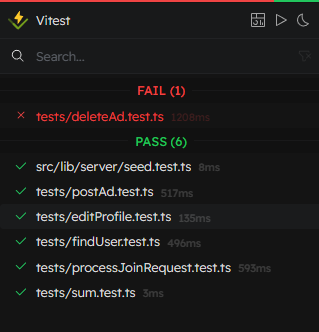
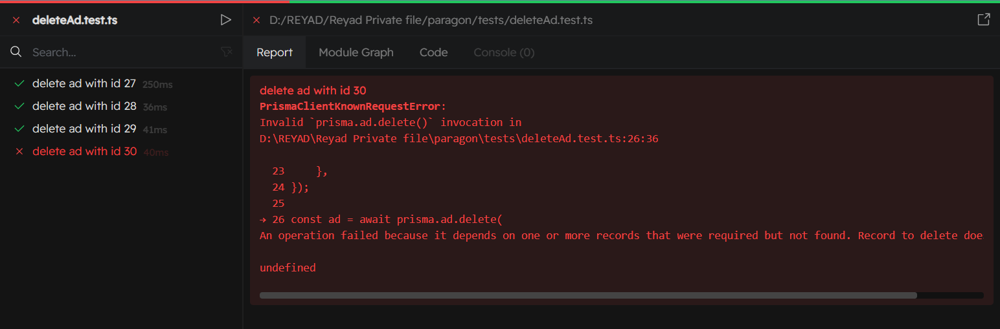
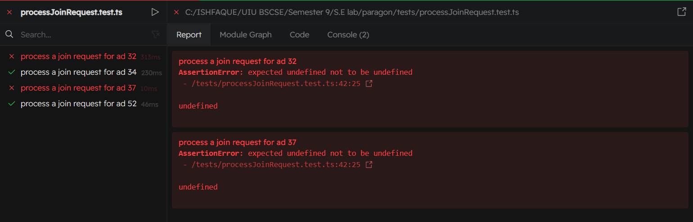

# Testing

For testing, we used the Vite plug in Vitest. SvelteKit is relatively new, so testing libraries have changed from Jest to Vitest.

For our unit testing, we decided to simulate if different database accesses similar to our API. We decided to test four things:

## Post Ad

    import { test, expect } from 'vitest';
    import { prisma } from '$lib/server/prisma';
    import { now } from 'svelte/internal';

    const tags = [
        {
        tag: {
            connect: {
            id: 9,
            },
        },
        },
        {
        tag: {
            connect: {
            id: 22,
            },
        },
        },
    ]
    const ad = {
        userid: "7c4Q1RfvQCMOmzm",
        salaryType: "negotiable",
        expectedSalary: 100,
        typeOfTutor: "offline",
        description: "lorem ipsum",
        title: "Geometry Tutor",
        workDays: "[5,6]",
        startTime: now.toString(),
        endTime: now.toString(),
        tags: {
            create: tags
        }
    }

        test(`post an Ad`, async () => {
            const postReq = await prisma.ad.create({
                data: ad
            })

            expect(postReq).toBeDefined();
        });

## Delete Ad

    import { test, expect } from 'vitest';
    import { prisma } from '$lib/server/prisma';
    
    const adIdsToDelete = [27, 28, 29, 30]; 
    
    for (const adId of adIdsToDelete) {
        test(`delete ad with id ${adId}`, async () => {
            const deleteReq = await prisma.request.deleteMany({
                where: {
                    adId: adId,
                },
            });

        const appointment = await prisma.appointment.deleteMany({
            where: {
                adId: adId,
            },
        });

        const adTag = await prisma.adTag.deleteMany({
            where: {
                adId: adId,
            },
        });

        const ad = await prisma.ad.delete({
            where: {
                id: adId,
            },
        });

        expect(deleteReq).toBeDefined();
        expect(appointment).toBeDefined();
        expect(adTag).toBeDefined();
        expect(ad).toBeDefined();
        });
    }

Test result of Delete Ad

## Process Join Request

    import { test, expect } from 'vitest';
    import { prisma } from '$lib/server/prisma';
    
    let userId = "7c4Q1RfvQCMOmzm";
    const test_cases = [32, 34, 37, 52];
    
    test_cases.forEach(ad_id => {
        test(`process a join request for ad ${ad_id}`, async () => {
                const adId = ad_id;
                let req;
                const checkif_req = await prisma.request.findMany({
                    where: { 
                        AND: [
                            {adId: adId},
                            {userId: userId}
                        ]
                    },
                })
        
                const checkif_app = await prisma.appointment.findMany({
                    where: { 
                        AND: [
                            {adId: adId},
                            {studentId: userId}
                        ]
                    },
                })
        
                if(checkif_req.length===0 && checkif_app.length===0){
                    req = await prisma.request.create({
                        data: {
                            adId: adId,
                            userId: userId,
                        }
                        
                    })
                    console.log(req); 
                }
                
                expect(req).toBeDefined();
        });
    });

Test result of Join Request Process

## Edit Profile

    import { describe } from 'vitest';
    import { test, expect } from 'vitest';
    import { prisma } from '$lib/server/prisma';

    test('Update users profile', async () => {
        const updated_user = await prisma.user.update({
            data: {
                // username: username,
                name: "Test",
                // email: email,
                bio: "Test bio",
                phone: "0190000000",
            },
            where: {
                id: "vgZ2ncMmT4FvLJU",
        
            }
        })
        
        expect(updated_user).toBeDefined();
    });

