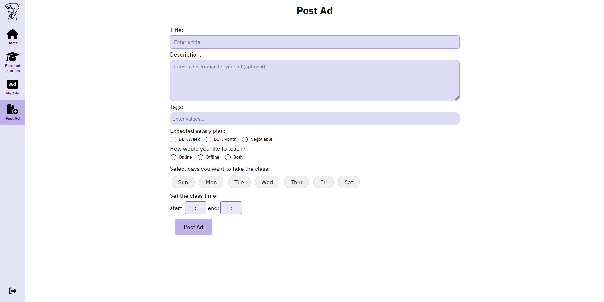

# User Guide

## Getting started

Entering the site for the first time you can search for ads. Also, you can view all the ads posted by signed up users. You will be limited to only viewing this ads. In order to actually join one you need to register.

On the top right corner, click on the register button to view the step wise registration form. At first, we ask how you intend to use the site; maybe you want to teach others or you are looking for a tutor that fits your academic demands etc. As you proceed to the next steps, depending on your usability preference either one or two more steps are to be completed. For a quick registration, just choose the student option then provide some basic information(like your name, email address  and password) to get started in your Paragone journey!

## Core concepts

To begin with, we kept the type of user very flexible. A user is free to use the site services as per his likings. Therefore, there are three possible ways that a user might interact with the site. First of all, a user can simply join course(s) and attend classes. Secondly, a user may post advertisements that he would like to teach others. Then conduct classes as per his schedule. Finally, there can be users who wants to teach others and at the same time enroll in courses posted by other users.

## Joining a course

As a registered user, you can send join request to the ad posts viewed in the home page.

## Check enrolled courses

Once enrolled in a course and the teacher accepts you into the course, you can view it on the Enrolled courses tab on the left.

Each course has its own course details, which will show your classmates. To access course details, click on the course.

## Schedule and Chat

Each course has its own schedule that has been defined when posting the ad, and a chat between the teacher and their students.

These are both accessible at the top bar.

## Post advertisements

To post an ad, we have this page. After posting an ad, it should show up under My Ads.

## Deleting or editing the course

It's possible to delete the course from My Ads by clicking the 'X' button, which will give you a prompt to confirm deletion.

You can also click on the ad to change any necessary information or just launch the course.

## Launching course

The launch button can only be pressed if there is at least one student enrolled to the course. If you want to accept a student, the requests will be on the right side.

After accepting a student, you can click on 'Launch' and you will be greeted with the launched course, from which you can view the schedule and chat from the top bar.

